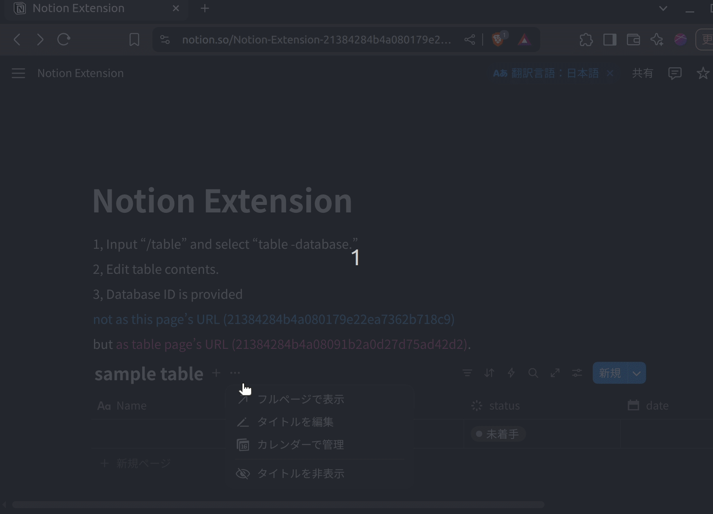

# 📝 Notion Extension

このツールは、気になる Web サイトやリンクを **コマンドラインから Notion に記録** するためのスクリプトです。

---

## 🚀 機能概要

- ターミナルから Notion にブックマークページを追加
- エイリアスを設定してコマンドとして使用可能

---

## 📦 セットアップ手順

### 1. リポジトリのクローン

```bash
git clone https://github.com/kamada-akitoshi/notion_extension.git
cd notion_extension
```

### 2. Notion データベースの作成
1. Notion の新規ページで Table を挿入


2. Table に要素を追加


3. 「インテグレーションを開発」でデータベースに API を接続


### 3. `.env` ファイルの作成

プロジェクトのルートディレクトリに `.env` ファイルを作成し、以下のように記入してください：

```
NOTION_TOKEN=
DATABASE_ID=
NOTION_API_URL=
```

---　

### 🔑 各変数の説明と取得方法：

- **NOTION_TOKEN**  
  [Notion Developers - My Integrations](https://www.notion.so/my-integrations) にアクセスし、My Integrationsで取得する40文字程度のトークン（先頭はntn_）。

- **DATABASE_ID**  
  使用したい Notion データベースをブラウザで開いたときの URL に含まれる32桁の英数字。
  

- **NOTION_API_URL**  
  Notion APIのエンドポイントURL `https://api.notion.com/v1/pages` を使用。


### 4. スクリプトの実行権限付与とエイリアス設定

以下のコマンドを実行して、スクリプトに実行権限を付与してください。

```bash
chmod +x path/to/notion_extension/notion.sh
```

次に、`~/.bashrc`（または使用しているシェルの設定ファイル）にエイリアスを追加します。

```bash
echo 'alias notion="path/to/notion_extension/notion.sh"' >> ~/.bashrc
```

設定を反映

```bash
source ~/.bashrc
```

---

### 5. コマンドの使い方

気になるウェブサイトのタイトルとURLをコマンドラインから Notion に保存できます。

```bash
notion bookmark 任意のタイトル,http://example.com
```


## 🔒 セキュリティに関する注意

`.env` ファイルにはAPIトークンなどの機密情報が含まれるため、Git にコミットしないように注意してください。

プロジェクトの `.gitignore` に以下があることを確認してください。

```
.env
```


---


